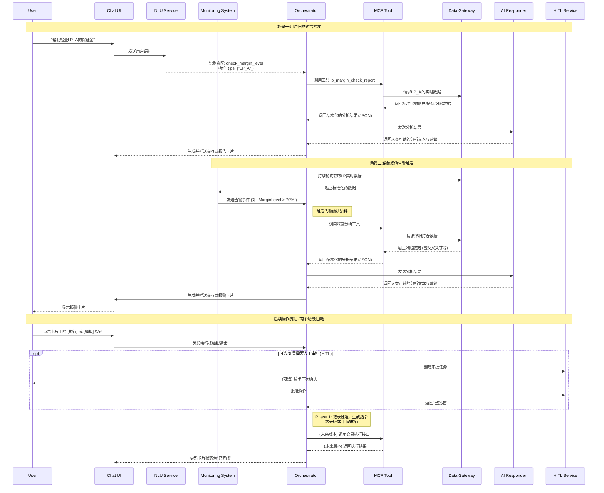

## 1. 概述 (Overview)

### 1.1. 背景与问题

**外汇经纪商 (Broker) 在多个流动性提供商 (LP) 处开设保证金账户以对冲风险。由于资金成本和杠杆差异，这些账户常面临保证金水平过高甚至被强制平仓 (爆仓) 的风险，可能导致重大经济损失。当前，经纪商的运维和风控团队依赖人工、高频地监控这些账户，流程效率低下、响应延迟且易出错。**

### 1.2. 目标

**LP Margin Check 功能旨在通过 AI 原生的方式，将这一高风险、重复性的监控任务自动化、智能化，实现以下核心目标:**

- **主动风险预警:** 从被动监控转变为主动、实时的风险识别与告警。
- **智能决策辅助:** 基于 SOP 与实时数据，为客户 (的风险管理人员) 提供清晰、可执行的处置建议，而不仅仅是数据陈列。
- **人机协同提效:** 通过对话式交互与引导式操作，将人工经验 (SOP) 与系统自动化能力结合，实现高效、安全的闭环处理。
- **审计与合规:** 确保所有监控、决策、执行过程完全留痕，满足审计与复盘要求。

### 1.3. 核心价值

| **价值点**       | **描述**                                                               |
| ---------------- | ---------------------------------------------------------------------- |
| **降低经济损失** | 避免因保证金不足导致的 LP 账户爆仓。                                   |
| **提升运营效率** | 将团队从重复性监控中解放出来，聚焦于更高价值的风险决策。               |
| **简化内部协同** | 为客户内部的运维和风控角色提供统一、透明的信息视图和标准化的处置流程。 |
| **保障操作合规** | 通过 Human-in-the-Loop 机制确保所有自动化操作安全可控，全程可追溯。    |

### 1.4 用户故事 (User Stories)

#### **用户故事: 保证金告警处理流程(客户视角)**

**作为一名 Broker:**

1. 当我的 LP 账户保证金水平达到预警阈值（如 70%）时，系统应通过弹窗或悬浮卡片的方式，实时告知我当前保证金状态，无论我处于交易界面还是与机器人聊天窗口，都能第一时间收到该警报并持续监控健康状态。
<!-- 标注：已更新为实时弹窗/悬浮窗监控，确保任意界面可见 -->
2. 在收到警报后，系统需优先提示我是否需要清理 Cross Position。若我选择清理，系统应自动执行相关操作，并在清理完成后再次检查报警原因，生成一份全面的处理方案报告。该报告需明确说明报警根因、是否需要进一步人工干预，并结合我客户以往的处理风格，给出个性化的干预建议或方案。
<!-- 标注：已补充分步“清理cross”及清理后再次分析、结合客户风格个性化建议 -->
3. 若确实需要移仓，报告应推荐合适的目标 LP 及对应操作成本，方便我快速评估风险并选择最佳方案进行移仓操作。操作完成后，系统应即时展示处理后的最新保证金水平，帮助我确认风险是否已解除。
<!-- 标注：已强调移仓推荐与成本评估、处理后风险确认 -->

## 2. 功能范围 (Scope)

### 2.1. In-Scope (范围内)

- **数据聚合:** 通过 Data Gateway 自动拉取并聚合所有已配置 LP 的保证金账户数据 (如 Equity, Margin, Margin Level, Positions)。
- **实时告警:** 当任一 LP 账户的保证金水平突破独立配置的阈值时，立即触发告警。
  <!-- 标注：确保实时告警与弹窗/悬浮窗机制一致 -->
- **智能分析与建议:**
  - 自动识别主要风险仓位 (按保证金占用排序)。
  - 自动检测可优化的跨 LP 对冲仓位 (Cross Positions)，并在告警时优先建议清理。
    <!-- 标注：分步建议优先清理cross position，符合新user story -->
  - 基于内置 SOP 逻辑，生成多层级的操作建议 (如: 平掉对冲仓位、移仓、建议入金等)。
  - 清理操作后自动重新分析并生成报告，结合客户历史风格给出个性化干预建议。
    <!-- 标注：已补充清理后自动分析与个性化建议流程 -->
- **人机交互与确认:**
  - 通过 Web UI 卡片、Teams/Telegram 消息、对话式机器人等多渠道推送告警与建议。
  - 支持用户通过交互确认操作意图，并由系统生成具体执行指令。
- **模拟与执行 (带 HITL):（optional）**
  - 支持模拟模式，仅展示操作建议和预期结果，不产生实际交易。
  - 在用户通过 Human-in-the-Loop (HITL) 审批后，调用 MT4/MT5 Manager API 或 Bridge FIX API 执行交易指令。
  - 预留接口：支持后续直接请求下单（如`/trade/execute`），便于后端扩展自动化交易功能。
    <!-- 标注：已预留下单接口描述，便于后续开发 -->

### 2.2. Out-of-Scope (范围外)

- **资金自动划拨:** 本功能不直接执行跨系统、跨银行的资金调拨。
- **交易撮合逻辑:** 不负责订单的撮合与执行细节，仅作为指令发送方。
- **SOP 规则制定:** 不提供 SOP 规则的编辑界面，SOP 逻辑的更新被视为算法/模型更新。
- **LP 账户开设与配置:** LP 账户的基础信息配置由 Admin 后台完成，本功能仅消费这些配置。
- **AI 对话即时查询:** 虽然支持自然语言查询，但关于**特定事件(如清理操作前后)** 、**特定市场波动提醒以及重要经济事件前后的复杂即时对话查询功能**不属于核心 Margin Check 场景，将作为后续迭代的单独功能模块进行开发。

## 3. 核心流程与架构 (Core Flow & Architecture)

**本功能严格遵循 PulseDesk-L1-产品总纲定义的架构，核心是 AI Orchestration Layer 对底层黑盒 API 的编排与增值。**

### 3.1. 总体架构图



### 3.2. 核心场景流程

#### 场景 A:一键触发 Margin Check Routine 检查

- **触发**: 用户在 UI 界面上点击“一键检查”按钮，触发 Orchestrator 服务。
- **执行**: Orchestrator 调用 `<span class="selected">lp_margin_check_report</span>` 工具。
- **数据聚合:** 工具通过 Data Gateway 获取所有 LP 的实时数据。
- **分析:** 工具根据内置逻辑进行计算，识别潜在风险。
- **生成:** AI Responder 将结构化数据渲染成人类可读的摘要报告 (如 “所有 LP 保证金水平正常” 或 “发现潜在风险，请查看详情”)。
- **推送:** 报告以交互式卡片的形式返回给 UI 界面，供用户查看。

#### 场景 B:超过阈值告警触发

- **触发:** 当任一 LP 账户的保证金水平突破独立配置的预警 (Warning) 或紧急 (Critical) 阈值时，自动触发告警事件到消息总线。
- **深度分析:**
  - **预警场景**: Orchestrator 调用工具进行深度分析，识别主要风险仓位和交叉头寸。
  - **紧急场景**: 系统跳过部分分析步骤，直接进入紧急处置流程。
- **AI Responder 根据 SOP 逻辑生成建议:**
  - **首要建议**: 若存在交叉头寸，建议优先清理。
  - **备选建议**: 若非交叉头寸或清理后仍未解除，判断是否由个别账户导致。**若是** **，提供该账户的交易行为分析报告；若不是** **，直接建议进行移仓操作，并推荐合适的目标 LP。**
  - **紧急建议**: 在紧急场景中，系统会提供最激进的处置方案，如立即清理交叉头寸或者立即停仓并建议尽快入金，以快速释放保证金。
- **推送与交互:**
  - 系统向用户推送紧急告警卡片，包含状态、分析和建议。
  - **卡片上提供按钮:** [执行] 、 [模拟]、[导出 PDF]、[忽略]。
- **闭环:**
  - 客户点击[执行]，请求进入 HITL 审批流。
  - 审批通过后，Orchestrator 调用交易执行工具完成操作。
  - 系统持续监控并推送最终结果，确认风险是否已解除。

#### 场景 C: AI 自然语言触发

- **触发:** 客户在对话框中输入 “帮我检查 LP margin 水平” 或 “LP_A 的保证金怎么样了?”。
- **意图识别:** NLU 模块识别出意图为 `<span class="selected">check_margin_level</span>`，并抽取出槽位 (slot)，如 `<span class="selected">{lps: ["LP_A"]}</span>`。
- **执行:** Orchestrator 调用 `<span class="selected">lp_margin_check_report</span>` 工具，并传入从 NLU 获取的参数。
- **分析与生成:** 同场景 B，系统进行数据分析并由 AI Responder 生成解读和建议。
- **响应:** 系统在对话界面中返回一个包含结果的交互式卡片，内容与告警卡片类似，供客户决策。

## 4. 任务按角色分配 (Task Breakdown by Role)

**为便于开发团队并行工作，此处将上述功能需求按技术角色进行分解。**

### 4.1. 前端 (Frontend)

#### 聊天界面开发:

- 构建一个基础的对话 UI，支持用户文本输入和消息历史展示.
- **关联任务:** Epic 3 Task 3.3

#### 交互式卡片渲染:

- 根据后端下发的 Card Schema (JSON)，动态渲染包含状态、分析文本、建议和操作按钮的报告卡片。
- **注意**:卡片需要支持动态内容，例如建议区域可能存在一个、多个或没有建议
- **关联任务:** Epic 3 Task 3.1

#### 用户操作处理:

- 实现卡片上[执行], [模拟], [导出 PDF], [忽略]等按钮的点击事件。
- 将用户的操作意图(如点击“执行”)封装后发送给后端 Orchestrator。
- **关联任务:** Epic 4 Task 4.1, 4.2
- **状态更新:** 接收后端的推送，实时更新卡片状态(如从“处理中”变为“已完成”)。

#### 审计追溯展示 (最小化):

- 在卡片上增加一个“查看历史”或类似的图标/链接。
- 点击后，通过一个简单的模态框或展开区域，展示本次查询的操作历史(如:查询发起 -> 分析完成 -> 用户批准)。
- **关联任务:** Epic 4 Task 4.3

### 4.2. 后端/编排 (Backend/Orchestration)

#### 核心编排逻辑:

- 搭建 Orchestrator 服务，作为整个流程的中枢。
- 接收来自 NLU 的意图，调用相应的 MCP 工具。
- 整合工具的分析结果和 AI Responder 的文本，组装成最终的 Card Schema JSON。
- **关联任务:** Epic 1 Task 1.3, Epic 3 Task 3.3

#### HITL 集成:

- 当收到前端的“执行”请求时，调用 HITL 服务创建审批任务。
- 在 Phase 1，接收到 HITL “已批准”的回调后，更新任务状态并记录日志。
- **关联任务:** Epic 4 Task 4.2

#### 审计日志:

- **L1:** 实现结构化的日志服务，记录从用户查询到最终决策的每一个关键步骤和数据快照。提供一个 API，根据 cardId 返回该次任务的操作历史记录，供前端“审计追溯展示”使用。
- **L2:** 设计统一的审计日志数据模型，并建立中心化的日志存储 (如 Elasticsearch, Loki 等)。确保 L1 的日志能被标准化地送入 L2 存储。提供全局日志的查询 API。
- **关联任务:** Epic 4 Task 4.3

#### 报告导出服务:

- 开发一个 API 端点，接收报告 ID，生成并返回 PDF 或 HTML 文件流。
- **关联任务:** Epic 1 Task 1.2

### 4.3. AI/NLU

#### 意图识别与槽位填充:

- 配置或训练 NLU 模型，使其能准确识别 **`<span class="selected">check_margin_level</span>`** 意图。
- 实现从用户语句中提取 LP 名称作为 **`<span class="selected">lps</span>`** 槽位。
- **关联任务:** Epic 3 Task 3.2

#### AI 分析解读 (Responder):

- 开发 AI Responder 模块。
- **输入:** MCP Tool 生成的结构化分析 JSON。
- **输出:** 一段人类可读的、有洞察的分析摘要和建议文本 (如线框图所示)。这可能需要设计一个精巧的 Prompt 模板。
- **关联任务:** Epic 2 Task 2.3

### 4.4. 数据/集成 (Data/Integration)

#### 数据适配器开发:

- 在 Data Gateway 中，为至少 2 个 LP 源 (如 LMAX, CFH) 开发数据适配器，将它们各自 API 返回的数据 (余额、持仓等) 清洗并转换为内部标准格式。
- **关联任务:** Epic 1 Task 1.1

#### 核心分析工具 (MCP Tool):

- 开发 **`<span class="selected">lp_margin_check_report</span>`** 工具。
- **输入:** 标准化的 LP 数据。
- **核心逻辑:** 计算保证金水平、识别高风险仓位、检测跨 LP 的对冲仓位 (Cross Positions)
- **输出:** 一份结构化的分析结果 JSON，供 Orchestrator 和 AI Responder 使用。
- **关联任务:** Epic 2 Task 2.1, 2.2

#### 交易执行接口 (未来版本):

- 预研并定义调用 Bridge FIX API 执行交易的接口规范。
- **关联任务:** Epic 4 Task 4.2

## 5. 核心数据流与接口契约 (Data Contracts)

_说明:以下契约围绕架构图中的关键“边”(数据流)进行定义，字段以骨架为主，尽量少填示例值，便于后端与 AI 并行细化与实现。_

### 5.1 Client/Chat → NLU(意图识别)

- **请求** **(来自前端/聊天机器人):**

```
  {
    "tenantId": "<tenant_id>",
    "userId": "<user_id>",
    "utterance": "帮我检查LP_A的保证金水平",
    "channel": "web|teams|telegram",
    "context": { "locale": "zh-CN" }
  }

```

- **响应** **(NLU 输出):**

```
  {
    "intent": "check_margin_level",
    "confidence": 0.0,
    "slots": {
      "scope": "broker|lp|group",
      "lps": ["<lp_name>"],
      "timepoint": "<ISO8601>"
    },
    "traceId": "<trace_id>"
  }

```

### 5.2 Orchestrator → MCP Tool(工具调用入参)

```
{
  "tool": "lp_margin_check_report",
  "inputs": {
    "scope": "broker|lp|group",
    "lps": ["<lp_name>"] ,
    "timepoint": "<ISO8601>",
    "options": { "requirePositionsDepth": true, "detectCrossPositions": true }
  },
  "tenantId": "<tenant_id>",
  "traceId": "<trace_id>"
}

```

### 5.3 Data Gateway → MCP Tool(标准化数据集)

```
{
  "accounts": [{ "id": "<id>", "lp": "<lp>", "group": "<group>" }],
  "balances": [{
    "lp": "<lp>",
    "equity": 0.0,
    "balance": 0.0,
    "marginUsed": 0.0,
    "freeMargin": 0.0,
    "credit": 0.0,
    "leverage": 0
  }],
  "positions": [{
    "id": "<pos_id>", "lp": "<lp>", "symbol": "<symbol>", "side": "buy|sell",
    "volume": 0.0, "price": 0.0, "margin": 0.0, "swap": 0.0, "timestamp": "<ISO8601>"
  }],
  "riskIndicators": [{ "lp": "<lp>", "marginLevel": 0.0, "exposure": 0.0 }],
  "thresholds": [{ "lp": "<lp>", "warn": 0.0, "critical": 0.0 }],
  "costsAndMarket": {
    "spreads": [{ "symbol": "<symbol>", "lp": "<lp>", "value": 0.0 }],
    "swaps": [{ "symbol": "<symbol>", "lp": "<lp>", "long": 0.0, "short": 0.0 }],
    "commissions": [{ "lp": "<lp>", "value": 0.0 }]
  },
  "routingConstraints": {
    "allowedSymbols": [{ "lp": "<lp>", "symbols": ["<symbol>"] }],
    "tradingWindows": [{ "lp": "<lp>", "from": "<iso>", "to": "<iso>" }]
  },
  "historyWindow": { "from": "<ISO8601>", "to": "<ISO8601>" }
}

```

_说明:上述字段由 Data Gateway 聚合 Risk API / LPs API / Admin API 后标准化。字段可按实现细化或扩展，但需保持契约向后兼容。_

### 5.4 MCP Tool → Orchestrator(分析结果)

```
{
  "status": "ok|warn|critical",
  "metrics": { "avgMarginLevel": 0.0, "lpCount": 0 },
  "perLP": [{
    "lp": "<lp>",
    "equity": 0.0,
    "marginUsed": 0.0,
    "marginLevel": 0.0,
    "thresholdsRef": { "warn": 0.0, "critical": 0.0 },
    "topPositionsKey": ["<pos_id>"]
  }],
  "crossCandidates": [{
    "symbol": "<symbol>",
    "lpA": "<lp>", "lpB": "<lp>",
    "volumePair": { "a": 0.0, "b": 0.0 },
    "releasableMargin": 0.0
  }],
  "moveCandidates": [{
    "fromLP": "<lp>", "toLP": "<lp>", "symbol": "<symbol>", "volume": 0.0,
    "rationale": "<text>"
  }],
  "recommendations": [{
    "id": "<rec_id>", "type": "CLEAR_CROSS|MOVE|DEPOSIT|WAREHOUSE",
    "priority": 1,
    "actions": [{ "tool": "execute_trade|notify|...", "params": {}}]
  }],
  "traceId": "<trace_id>"
}

```

### 5.5 AI Responder I/O(叙述与话术生成)

- **输入** **:**

```
  { "analysis": { /* 来自上一节 */ }, "SOPRefs": ["<doc_id>"] , "policy": { "tone": "concise" } }

```

- **输出** **:**

```
  {
    "summary": "<text>",
    "risks": ["<text>"] ,
    "suggestions": [{ "title": "<text>", "body": "<text>", "recId": "<rec_id>" }]
  }

```

### 5.6 Orchestrator → UI/Chat(交互卡片 Schema)

```
{
  "cardId": "<id>",
  "status": "ok|warn|critical",
  "highlights": [{ "label": "Avg ML", "value": "<pct>" }],
  "sections": [{ "title": "<LP_A>", "rows": [{ "k": "Margin Level", "v": "<pct>" }] }],
  "actions": [
    { "id": "simulate", "label": "模拟", "type": "SIMULATE", "payload": { "recId": "<rec_id>" } },
    { "id": "execute", "label": "执行", "type": "EXECUTE", "payload": {  "recId": "<rec_id>" }, "hitlRequired": true }
  ],
  "traceId": "<trace_id>"
}

```

### 5.7 HITL(审批)请求/回执

- **请求** **:**

```
  {
    "draftId": "<id>",
    "actionRef": { "recId": "<rec_id>", "tool": "execute_trade" },
    "impactEstimates": { "afterMarginLevel": 0.0, "releasableMargin": 0.0 },
    "requester": { "userId": "<id>", "role": "<role>" }
  }

```

- **回执** **:**

```
  { "draftId": "<id>", "decision": "approved|rejected", "approver": "<userId>", "comment": "<text>" }

```

### 5.8 错误与数据新鲜度标记

```
{ "errors": [{ "source": "<RiskAPI|LPsAPI|AdminAPI>", "code": "<code>", "message": "<msg>" }],
  "dataFreshness": { "lp": "<lp>", "ageSec": 0 },
  "missingSources": ["<lp|api>"] }

```

_注:审计事件 Schema 见第 8 章(审计与日志)。_

## 6. UI/UX 设计 (UI/UX Design)

### 6.1. 设计原则

- **信息降噪 (Signal over Noise):** 直接展示最关键的风险点和建议，而不是罗列原始数据。
- **状态驱动 (Status-Driven):** 使用明确的颜色 (绿/黄/红) 和标签 (正常/警告/危险) 来传达紧急程度。
- **引导操作 (Guided Actions):** 为用户提供清晰的 “下一步” 按钮，将复杂的决策简化为几次点击。
- **过程透明 (Transparency):** 用户应能随时下钻查看建议背后的原始数据和分析逻辑。

### 6.2. 交互方式与线框图 (Wireframe)

**首页健康度卡片**

```
+--------------------------------------------------+
| LP Margin Health        [ OK ](green)  10:00 AM  |
|--------------------------------------------------|
| Avg. Margin Level: 65%                           |
|                                                  |
| No critical risks detected.                      |
|                                                  |
|                                  [ View Report ] |
+--------------------------------------------------+

```

**告警卡片 (Teams/Web)**

```
+--------------------------------------------------+
| LP Margin Alert         [CRITICAL](red) 10:05 AM |
|--------------------------------------------------|
| LP_A Margin Level at 90% (Threshold: 85%)        |
|                                                  |
| **AI Analysis & Suggestion:** |
| Priority 1: Clear cross-LP hedge on EURUSD (80   |
| lots) with LP_B. Expected to release $96k margin.|
|                                                  |
| [Execute Hedge Clearance] [Simulate] [Details]   |
+--------------------------------------------------+

```

## 7. 验收标准与测试 (Acceptance Criteria & Testing)

### 7.1. 功能验收标准

- **AC1:** 系统必须能够每小时生成一次所有 LP 的保证金健康度报告，并推送到指定渠道。
- **AC2:** 当任一 LP 的保证金水平超过其 critical 阈值时，系统必须在 30 秒内发出告警。
- **AC3:** 告警内容必须包含 SOP 中定义的首要建议 (如存在 Cross Position，则必须优先建议清理)。
- **AC4:** 用户可通过一次点击 (+HITL 审批) 执行首要建议，系统需能正确调用交易 API。
- **AC5:** "模拟" 功能必须能准确计算并展示操作后的预期保证金水平，且不产生实际交易。
- **AC6:** 所有告警、建议、决策和执行步骤都必须记录在审计日志中，且日志包含时间戳、操作人、和操作内容。

### 7.2. 测试要点

- **数据源测试:** 测试在某个 LP API 延迟或失败时，系统的容错和标注能力。
- **逻辑测试:**
  - 构造存在明显 Cross Position 的场景，验证系统是否优先提出清理建议。
  - 构造无 Cross Position 但保证金水平超标的场景，验证系统是否能正确推荐移仓目标 LP (综合考虑 Free Margin、交易成本等)。
- **边界测试:** 测试保证金水平恰好在阈值上/下的情况。
- **交互测试:** 在多渠道 (Web/Teams) 测试告警卡片的渲染和按钮的有效性。
- **权限测试:** 验证不同角色的用户 (如 Admin/Risk/主管) 在 HITL 流程中的权限是否正确。

## 8. 审计与日志 (Auditing and Logging)

**系统需记录以下结构化日志事件，以供后续审计、复盘和生成交接班报告:**

- **Event: MarginReportGenerated** **:**`<span class="selected">timestamp</span>`, `<span class="selected">trigger</span>` (scheduled/manual), `<span class="selected">reportData</span>` (JSON)
- **Event: MarginAlertTriggered** **:**`<span class="selected">timestamp</span>`, `<span class="selected">lp</span>`, `<span class="selected">marginLevel</span>`, `<span class="selected">threshold</span>`, `<span class="selected">alertData</span>` (JSON)
- **Event: ActionProposed** **:**`<span class="selected">timestamp</span>`, `<span class="selected">alertId</span>`, `<span class="selected">recommendations</span>` (JSON)
- **Event: ActionConfirmed** **:**`<span class="selected">timestamp</span>`, `<span class="selected">alertId</span>`, `<span class="selected">userId</span>`, `<span class="selected">chosenAction</span>`, `<span class="selected">hitlStatus</span>` (pending_approval)
- **Event: ActionExecuted** **:**`<span class="selected">timestamp</span>`, `<span class="selected">alertId</span>`, `<span class="selected">action</span>`, `<span class="selected">executionResult</span>` (success/fail), `<span class="selected">finalState</span>`
